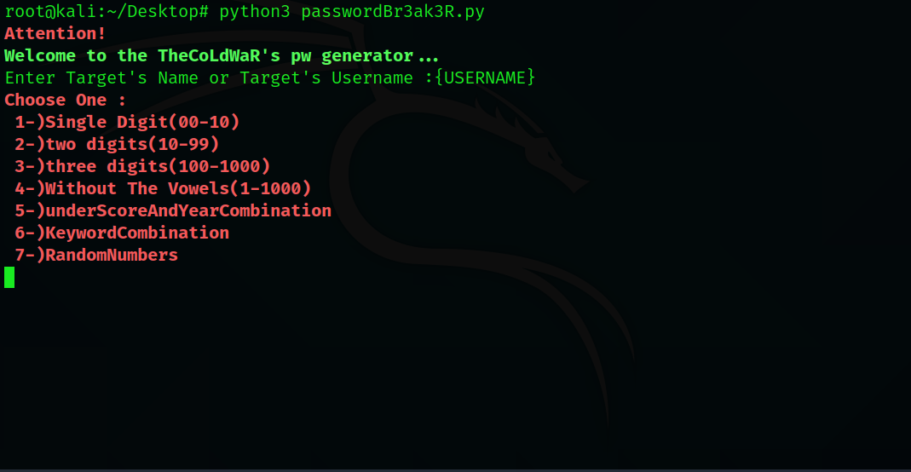

# passwordBr3ak3r
It helping cracking password.

Usage :Python3 passwordBr3ak3r

1-)Single Digit(00-10)  
2-)two digits(10-99)  
3-)three digits(100-1000)  
4-)Without The Vowels(1-1000)  
5-)underScoreAndYearCombination  
6-)KeywordCombination  
7-)RandomNumber  
